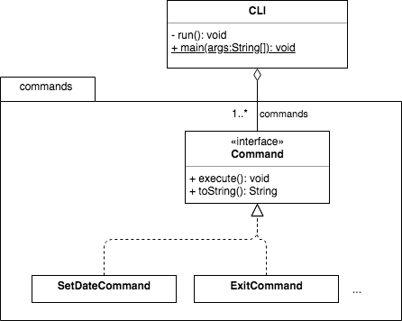

# Book Management System

-   Assignment Due: November 11, 2019 at 9:30am
-   Peer Assessment Due: November 11, 2019 at 11:59pm

In this assignment you will implement part of a simple library book management
system. Most of the functional requirements come from user stories prepared by
students. You will not be implementing all of the features necessary for a real
book management system.

### Objectives

Students will:

-   Gain additional experience developing software with a partner
    -   Gain experience using branches on a version control system
-   Demonstrate good software engineering practices
-   Learn three design patterns
    -   Builder Pattern
    -   Command Pattern
    -   Observer Pattern
-   Learn the Blackboard (or Repository) architectural style

## Instructions

This assignment is to be completed in assigned pairs; **no collaboration
other than with your assigned partner is permitted**.  One of the purposes of
pair-assignments is to practice teamwork. After completing the assignment you
will need to complete a peer assessment. Your contribution grade will be based
on the peer assessments and on the git history.

*Commit material that you worked on individually under your own name* using the
defaults that you set. *When (and only when) you commit material that was
developed using pair programming, override the default commit author to reflect
both authors* so that we can properly credit both authors for their contribution
grades. When you override the default commit author list both students' names,
and for the email address use a fake email address that is unique to the pair
of students by concatenating your Canvas login IDs (the angle brackets around
the email address are required):
```
git commit --author="Herbie Husker and Lil Red <hhusker20lred19@dev.null>"
```

##  Setup

1.  You and your partner will work on a shared repository, which has been
    prepared for you.

    1.  Navigate to your shared directory
        (<https://git.unl.edu/csce_361/fall2019/28pairNN/>, where *NN* is your
        team number).

    1.  Verify that the repository is private, and that you and your partner
        both have Maintainer access.

1.  Both students should:

    1.  Clone the project: `git clone <URL>` (here the angle brackets should
        not be included).

    1.  Import the project into your IDE. The project is set up as a Maven
        project, so you can follow your IDE's instructions to import a Maven
        project.

##  Assignment

You and your partner will implement a course registration system with limited
functionality.

### Architecture

The system should have a blackboard architecture. See Kung p156.

At a minimum, your blackboard datastore shall track the status of all books in
the system. You may read from a CSV or JSON file to initialize the datastore;
there is no requirement to save updates to a file. The datastore shall also
know the book management system's current date (which is not necessarily the
date in your computer).

All interactions between objects must occur indirectly through the blackboard
datastore, except:

-   The user interface object can call a command object's `execute()` method.
-   A command object can call one method on another object to initiate behavior
    (see the Design Patterns section).
-   Any object can add a command object to (and remove it from) the user
    interface object.

### Design Patterns

-   Use the *Builder Pattern* to create books that have some fields with
    default values and other fields with non-default values.
    -   Figure 16.22 on Kung p409
    -   HFDP, [a brief discussion in the "Leftover Patterns" appendix](https://learning.oreilly.com/library/view/head-first-design/0596007124/apa.html#builder)
    -   See discussion below on using the Builder pattern to implement default
        constructor arguments.
-   Use the *Command Pattern* to launch the appropriate behavior for each menu
    option.
    -   Figure 17.7 on Kung p432
    -   HFDP, [Chapter 6](https://learning.oreilly.com/library/view/head-first-design/0596007124/ch06.html)
    -   Remember: the command classes should have no logic; their sole
        responsibility is calling another object's method appropriate to
        initiate the desired behavior.
-   Use the *Observer Pattern* to notify interested objects of updates to the
    blackboard data store.
    -   Figure 16.27 on p413
    -   HFDP, [Chapter 2](https://learning.oreilly.com/library/view/head-first-design/0596007124/ch02.html)
    -   See discussion below on Java's implementation.

#### Default Constructor Arguments

The Builder Pattern, as discussed in both books, is a great way to create some
complex objects. It's also useful to overcome Java's lack of default
constructor arguments. Suppose you have a `Foo` class with two fields,
`int one` and `double two`. Suppose also that we want `one` to have a default
value of `1`, and `two` to have a default value of `2.0`. In a language that
has default arguments, we could implement this with a single constructor, such
as:
```
def __init__(self, one=1, two=2.0):
    self.one = one
    self.two = two
```
Java doesn't have default arguments, so we might try this:
```
public Foo() { this(1, 2.0); } // calls another constructor using default values
public Foo(int one) { this(one, 2.0); }
public Foo(double two) { this(1, two); }
public Foo(int one, double two) { this.one = one; this.two = two; }
```
Now suppose that instead of two fields, there are three. Or four. The number of
combinations grows exponentially. *If* you can make it work. In the example, `one` and `two` are different types. Suppose that `two` is an `int` instead of a `double`. The compiler won't let you create two constructors with the exact same signature in the same class:
```
public Foo(int one) { this(one, 2); }   // even if the compiler allowed this,
public Foo(int two) { this(1, two); }   // which is called for "Foo(5)"?
```
The solution is to create a builder class. As with both books, I recommend that
Foo be an interface (or an abstract class with mostly abstract methods). The
builder class is then free to select the best Foo implementation based on the
situation.
```
public class FooBuilder {
    private int one;
    private int two;

    public FooBuilder() {
        this.one = 1;
        this.two = 2;
    }

    public FooBuilder setOne(int one) {
        this.one = one;
        return this;
    }

    public FooBuilder setTwo(int two) {
        this.two = two;
        return this;
    }

    public Foo build() {
        return new ConcreteFoo(this.one, this.two);
    }

    /** The Foo implementation doesn't have to be an inner class,
        but it could be */
    private class ConcreteFoo {
        ConcreteFoo(int one, int two) {...}
        ...
    }
}
```
Now the `Foo` class needs only a single constructor, one that takes *all* of
the arguments. By calling a `setXX()` method, we override the default value; by
not calling it, we accept the default value, such as:
```
Foo foo1 = new FooBuilder().build();            // uses default values
Foo foo2 = new FooBuilder().setOne(5).build();  // overrides default "one"
Foo foo3 = new FooBuilder().setTwo(9).build();  // overrides default "two"
Foo foo4 = new FooBuilder().setOne(7).setTwo(12).build(); // overrides both
```

Our toy example here doesn't really illuminate the full value of separating the
interface from the implementation, but you should do so if only to make sure
that the client code cannot depend on a particular `Foo` implementation
(remember the Dependency Inversion Principle: depend on abstractions, not
concretions), which will make your code more maintainable. Doing so will also
get you in the habit for the that you do find it useful to be able to have your
code select from many possible implementations based on the situation.

#### Java's Implementation of the Observer Pattern

You may implement the Observer Pattern from scratch; however, a good practice
would be to use an existing implementation when one exists.

-   `java.util.Observer` and `java.util.Observable` have been part of the Java
    standard library from the beginning and would be a good choice
-   Java's `Observer` interface and `Observable` class have been deprecated
    since Java 9 due to their limited capabilities; however, this same
    simplicity makes them well-suited for your first experience with the
    Observer Pattern.
-   I recommend that you pass enough information in the `update()` call to let
    each observer decide whether a particular update is relevant to it; the
    observer can then decide whether it needs to get more information from the
    blackboard or to take action. Otherwise, an observer that doesn't know
    whether a particular update is relevant to it *will* have to query the
    blackboard to determine if there's a change it needs to respond to.

### Starter Code

-   The `src/main/java/edu/unl/cse/csce361/book_management/blackboard`
    directory contains:
    -   `CSVReaderWriter.java` is available if you want to use it to read a CSV
        file to populate the blackboard with books.
    -   `Book.java` is an incomplete interface definition for book objects.

-   `books.csv` is available in the `src/main/resources/csv` directory. It only
    has a couple of books; you'll want to add more, and possibly add more
    fields.

-   `CLI.java` is the beginning of a console-based menuing system. You are not
    obliged to use it.



-   The `src/main/java/edu/unl/cse/csce361/book_management/commands` directory
    contains:
    -   `Command.java` is an interface that's part of the Command Pattern.
        Implementations should override `java.lang.Object.toString()` to
        provide the string to be displayed on the menu.
    -   `ExitCommand.java` is an example implementation of `Command.java`
    -   `SetDateCommand.java` is the beginning of another implementation of
        `Command.java`; you will need to finish it after you have a way to set
        the date in your blackboard datastore.

### Functional Requirements

-   The user interface can be a simple console-based menuing system. You *may*
    write a GUI, but you will receive no extra credit for doing so.

    -   If you make `CLI.java` no longer the main class, update `pom.xml`'s
        `<mainClass>` tag with the new main class.

    -   When the main menu is displayed, the user shall be prompted to select a
        task from the menu. *Use the Command Pattern to initiate the task*

    -   When a selected menu item has been completed, the system will re-display
        the menu and re-prompt the user for input.

-   If a patron or librarian has a task to do because of an update to the
    inventory (such as a patron had a book on hold and the book was just
    checked-in) then the system shall print the task to be accomplished so that
    the user can select that task. *Use the Observer Pattern to let patron
    objects and librarian objects know about updates to the inventory*

-   The user shall be able to display a sorted list of books.

-   Implement all user stories in
    [`28-user_stories-Book_Managmenet_System.md`](28-user_stories-Book_Managment_System.md)

-   When the program starts up, the blackboard's date should be the current
    system date on your computer. Thereafter, the user shall be able to update
    the date to any arbitrary date. We are not concerned with time of day.

-   When the system starts up, the blackboard shall populate itself with books.
    If you decide to hard-code the initial book inventory, place that code in a
    separate initializer class. If you decide to read the initial book
    inventory from a file, use your best judgement in where to place the code.

-   Books

    -   While we are calling the inventory items "books," they may be any
        publication.
    -   In the interest of simplicity, we will assume each book is unique. If
        you decide to have multiple copies of some publication, include a field
        to distinguish between the unique copies (such as a `copyNumber` field).
    -   Every book must have a catalog number, and there is no default catalog
        number.
    -   All other book fields should have a default value if none is specified.
        -   A book must have a status, such as "on order", "shelved", "waiting
            to be shelved", "on hold", "missing", "checked out", "overdue", and/
            or any other statuses you find appropriate.
        -   Decide for yourself what other fields are appropriate.
        -   Select reasonable default values, such as "Anonymous" as the
            default author and an empty string as the default title.
        -   *Use the Builder Pattern to create books*

### Tests

Use your best judgement for unit tests. We recommend that you have some unit
tests to reduce the likelihood of an undiscovered bug costing you points, and
we recommend that you use unit tests to help with debugging, but we are not
requiring any particular number of tests.

### Branches

In addition to the master branch, you must have at least two development
branches and an integration/staging branch. Even though the usage should make
it clear which branch is the integration/staging branch, please give it a name
that makes it clear which branch is the integration/staging branch. Give the
development branches names appropriate to their specific purpose.

-   You may choose whether to have one development branch per student, per
    feature, or per issue; or you may device another scheme to organize your
    development branches.
-   Make original commits *only* to a development branch.
-   When you are ready to integrate your changes:
    -   Merge the integration/staging brach into your development branch
        -   `git merge staging` (assuming `staging` is the name of your
            integration/staging branch).
    -   Resolve any merge conflicts.
    -   Make sure your code still compiles, runs, and passes all of its tests.
    -   Double-check that while you resolved merge conflicts and verified that  
        your code remains unbroken, your partner didn't add anything to the
        integration/staging branch.
        -   `git diff staging` should show differences only in one direction.

        -   If there are differences in both directions, merge the integration/
            staging branch into your development branch again.
    -   Once your development branch is strictly ahead of the integration/
        staging branch, merge your development branch into the integration/
        staging branch.
        -   ```
            git checkout staging
            git merge your_development_branch
            ```
        -   There shouldn't be any merge conflicts (they should have all been
            resolved on your development branch), but resolve them if there are.
        -   Make sure your code still compiles, runs, and passes all of its
            tests. Because you already did this on your development branch,
            there shouldn't be any problems -- but better safe than sorry.
        -   Return to your development branch to continue your work.
            -   `git checkout your_development_branch`
-   When and only when both you and your partner agree it's safe to copy the
    integration/staging branch to the master branch, do so:
    -   ```
        git checkout master
        git merge staging
        ```

When we grade your use of branches, we can use metadata from the commits: each
commit knows what branch it was created in and which branches it's currently a
part of, and also which commit(s) is its parent(s) (a regular commit has a
single predecessor; a merge commit has two, from which we can determine which
branches were merged). Nonetheless, please do *not* delete any branches after
merging them -- if we can visually determine from the commit graph that you
used branches as required then we won't need to examine the metadata.

### Issue Tracker

-   Create at least one Git Issue for each user story. You will probably create
    more than one Issue for each story.

-   Create Issues for other tasks as you deem appropriate.

-   Use the Issue assignment to coordinate your & your partner's work.

-   When committing code, include a reference to the Issue(s) the code is for
    using the hashtag-number notation.

-   Close an Issue for subtasks as appropriate.  Close an Issue for a whole
    user story only after the code passes the story's acceptance criteria.

-   You may, of course, create additional Issues when you discover their need.

## Deliverables

For grading, we will clone your copy of the project after it is due, and we
will look for:

-   Source code for your book management system in the directory structure
    specified by the Maven convention
-   Unit tests for your source code

We will grade the deliverables in the master branch.

*It is your responsibility to ensure that your work is in the **correct
repository** and that we can access the repository at the **time the assignment
is due**.  We will grade what we can retrieve from the repository at the time
it is due.  Any work that is not in the correct repository, or that we cannot
access, will not be graded.*

## Assignment Rubric

The assignment is worth **40 points**:

-   **3 points** for implementing a blackboard architecture
    -   Central datastore
    -   Subsystems interact only indirectly through blackboard

-   **4 points** for implementing the Builder Pattern
    -   Use the Builder Pattern to create books, which may have specified or
        default values for their fields

-   **4 points** for implementing the Command Pattern
    -   The user interface retrieves the appropriate command object and calls
        its `execute()` method.
    -   The `execute()` method has no behavior of its own but simply cal.ls a
        method on some other object to initiate the desired behavior

-   **4 points** for implementing (or using) the Observer Pattern
    -   Objects interested in changes to the blackboard datastore can register
        themselves with the datastore to be notified of updates to the
        datastore; each observer then decides whether it needs to take action
        due to the update.

-   **3 points** for using good design principles

-   **3 points** for good coding style


-   **5 points** for implementing the user stories

-   **2 point** for implementing the other specified functionality


-   **2 points** for making regular commits; *i.e.*, not waiting until the end
    of the project to make a massive commit.

-   **2 points** for using Git Issues as directed.

-   **4 points** for using branches as directed.
    -   automatic 2 point deduction if any commits are made directly to the
        master branch

-   **4 point** for meaningful and well-formatted commit messages


This assignment is scoped for a team of 2 students. If, despite your attempts
to engage your partner, your partner does not contribute to the assignment then
we will take that into account when grading.

*If **at any time** your repository is public or has internal visibility then
you will receive a 10% penalty. Further, if another student accesses your
non-private repository and copies your solution then I will assume that you are
complicit in their academic dishonesty.*


## Contribution Rubric

The contribution is worth **10 points**:

-   **1 point** for completing peer assessment
-   **5 points** for equitable contribution based on peer assessments
-   **4 points** for equitable contribution based on git history
